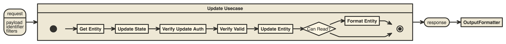
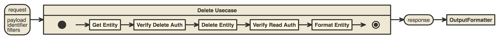

# Use Case Internals

## What is a use case?

Part of Hexagonal Architecture is the concept of the Application Boundary. This boundary separates our application as a whole from everything else (both framework and communication with the outside world).

> A Use Case (sometimes called a Command) is an explicitly defined way in which an application can be used.

We define how the outside world can communicate with our application by creating "Use Cases". These essentially are classes which name actions that can be taken. For example, our CreatePostUsecase defines that our application can create a post.

Defining Use Cases has some useful side-affects. For example, we clearly and explicitly can see how our application "wants" to be interacted with. We can plan use cases ahead of time, or add them as needed, but use cases should capture the operations which can happen within our application.

> Aside: Platform uses some generic CRUDS usecases. These aren't tied to a specific Domain Model (Entity) ie. a Post but rather have the entity and repo injected into them. This makes Use Cases significantly less well defined. A developer can no longer glance at the Use Case directory and see what actions are available. This might be something we can improve in future

## Anatomy of a Use Case (in platform)

Use Cases in platform all follow a high level interface. In short they all have a `interact()` method.

```
interface Usecase
{
	/**
	 * @return Array
	 */
	public function interact();
}
```

To enable building of some generic use cases they also have `isSearch` and `isWrite` methods.

```
interface Usecase
{
	/**
	 * Will this usecase write any data?
	 *
	 * @return Boolean
	 */
	public function isWrite();

	/**
	 * Will this usecase search for data?
	 *
	 * @return Boolean
	 */
	public function isSearch();

	/**
	 * @return Array
	 */
	public function interact();
}
```

The actual parameters for each UseCase are injected through setter methods, commonly: `setPayload()`, `setIdentifiers` and `setFilters`.

## CRUDS use cases

Most of our use cases follow 5 high level patterns for Create, Read, Update, Delete and Search (CRUDS)

### Create


[create](http://www.nomnoml.com/#view/%23title%3A%20Create%20UseCase%0A%5B%3Cstate%3Erequest%5D-%3E%5BCreate%20Usecase%5D%0A%5BCreate%20Usecase%5D-%3E%5B%3Cstate%3Eresponse%5D%0A%5B%3Cstate%3Eresponse%5D-%3E%5BOutputFormatter%5D%0A%0A%5B%3Cstate%3Erequest%7C%0Apayload%3B%0Aidentifier%3B%0Afilters%5D%0A%0A%5BCreate%20Usecase%7C%0A%20%20%20%20%20%5B%3Cstart%3E%20interact()%5D-%3E%5BGet%20Entity%5D%0A%20%20%20%20%20%5BGet%20Entity%5D-%3E%5BVerify%20Create%20Auth%5D%0A%20%20%20%20%20%5BVerify%20Create%20Auth%5D-%3E%5BVerify%20Valid%5D%0A%20%20%20%20%20%5BVerify%20Valid%5D-%3E%5BCreate%20Entity%5D%0A%20%20%20%20%20%5BCreate%20Entity%5D-%3E%5BGet%20Created%5D%0A%20%20%20%20%20%5BGet%20Created%5D-%3E%5B%3Cchoice%3E%20Can%20Read%3F%5D%0A%20%20%20%20%20%5B%3Cchoice%3E%20Can%20Read%3F%5D-%3E%5BFormat%20Entity%5D%0A%20%20%20%20%20%5BFormat%20Entity%5D-%3E%5B%3Cend%3E%20return%5D%0A%20%20%20%20%20%5B%3Cchoice%3E%20Can%20Read%3F%5D-%3E%5B%3Cend%3E%20return%5D%0A%5D%0A%0A%23direction%3A%20right)


[collaborators](http://www.nomnoml.com/#view/%23title%3A%20Create%20UseCase%20Collaborators%0A%0A%5BCreateUsecase%7C%7C%0Ainteract()%0AsetPayload()%5D%0A%0A%5BValidator%5D%3C-%2B%5BCreateUsecase%5D%0A%5BAuthorizer%5D%3C-%2B%5BCreateUsecase%5D%0A%5BFormatter%5D%3C-%2B%5BCreateUsecase%5D%0A%5BRepository%5D%3C-%2B%5BCreateUsecase%5D%0A%0A%5BCreateUsecase%5D-%3E%5B%3Cinput%3E%20payload%5D%0A%0A%23direction%3A%20right)

### Read


[read](http://www.nomnoml.com/#view/%23title%3A%20Read%20UseCase%0A%5B%3Cstate%3Erequest%5D-%3E%5BRead%20Usecase%5D%0A%5BRead%20Usecase%5D-%3E%5B%3Cstate%3Eresponse%5D%0A%5B%3Cstate%3Eresponse%5D-%3E%5BOutputFormatter%5D%0A%0A%5B%3Cstate%3Erequest%7C%0Apayload%3B%0Aidentifier%3B%0Afilters%5D%0A%0A%5BRead%20Usecase%7C%0A%20%20%20%20%20%5B%3Cstart%3E%20interact()%5D-%3E%5BGet%20Entity%5D%0A%20%20%20%20%20%5BGet%20Entity%5D-%3E%5BVerify%20Read%20Auth%5D%0A%20%20%20%20%20%5BVerify%20Read%20Auth%5D-%3E%5BFormat%20Entity%5D%0A%20%20%20%20%20%5BFormat%20Entity%5D-%3E%5B%3Cend%3E%20return%5D%0A%5D%0A%0A%23direction%3A%20right)

### Update


[update](http://www.nomnoml.com/#view/%23title%3A%20Update%20UseCase%0A%5B%3Cstate%3Erequest%5D-%3E%5BUpdate%20Usecase%5D%0A%5BUpdate%20Usecase%5D-%3E%5B%3Cstate%3Eresponse%5D%0A%5B%3Cstate%3Eresponse%5D-%3E%5BOutputFormatter%5D%0A%0A%5B%3Cstate%3Erequest%7C%0Apayload%3B%0Aidentifier%3B%0Afilters%5D%0A%0A%5BUpdate%20Usecase%7C%0A%20%20%20%20%20%5B%3Cstart%3E%20interact()%5D-%3E%5BGet%20Entity%5D%0A%20%20%20%20%20%5BGet%20Entity%5D-%3E%5BUpdate%20State%5D%0A%20%20%20%20%20%5BUpdate%20State%5D-%3E%5BVerify%20Update%20Auth%5D%0A%20%20%20%20%20%5BVerify%20Update%20Auth%5D-%3E%5BVerify%20Valid%5D%0A%20%20%20%20%20%5BVerify%20Valid%5D-%3E%5BUpdate%20Entity%5D%0A%20%20%20%20%20%5BUpdate%20Entity%5D-%3E%5B%3Cchoice%3E%20Can%20Read%3F%5D%0A%20%20%20%20%20%5B%3Cchoice%3E%20Can%20Read%3F%5D-%3E%5BFormat%20Entity%5D%0A%20%20%20%20%20%5BFormat%20Entity%5D-%3E%5B%3Cend%3E%20return%5D%0A%20%20%20%20%20%5B%3Cchoice%3E%20Can%20Read%3F%5D-%3E%5B%3Cend%3E%20return%5D%0A%5D%0A%0A%23direction%3A%20right)

### Delete


[delete](http://www.nomnoml.com/#view/%23title%3A%20Delete%20UseCase%0A%5B%3Cstate%3Erequest%5D-%3E%5BDelete%20Usecase%5D%0A%5BDelete%20Usecase%5D-%3E%5B%3Cstate%3Eresponse%5D%0A%5B%3Cstate%3Eresponse%5D-%3E%5BOutputFormatter%5D%0A%0A%5B%3Cstate%3Erequest%7C%0Apayload%3B%0Aidentifier%3B%0Afilters%5D%0A%0A%5BDelete%20Usecase%7C%0A%20%20%20%20%20%5B%3Cstart%3E%20interact()%5D-%3E%5BGet%20Entity%5D%0A%20%20%20%20%20%5BGet%20Entity%5D-%3E%5BVerify%20Delete%20Auth%5D%0A%20%20%20%20%20%5BVerify%20Delete%20Auth%5D-%3E%5BDelete%20Entity%5D%0A%20%20%20%20%20%5BDelete%20Entity%5D-%3E%5BVerify%20Read%20Auth%5D%0A%20%20%20%20%20%5BVerify%20Read%20Auth%5D-%3E%5BFormat%20Entity%5D%0A%20%20%20%20%20%5BFormat%20Entity%5D-%3E%5B%3Cend%3E%20return%5D%0A%5D%0A%0A%23direction%3A%20right)

### Search


[search](http://www.nomnoml.com/#view/%23title%3A%20Search%20UseCase%0A%5B%3Cstate%3Erequest%5D-%3E%5BSearch%20Usecase%5D%0A%5BSearch%20Usecase%5D-%3E%5B%3Cstate%3Eresponse%5D%0A%5B%3Cstate%3Eresponse%5D-%3E%5BOutputFormatter%5D%0A%0A%5B%3Cstate%3Erequest%7C%0Apayload%3B%0Aidentifier%3B%0Afilters%5D%0A%0A%5BSearch%20Usecase%7C%0A%20%20%20%20%20%5B%3Cstart%3E%20interact()%5D-%3E%5BGet%20Entity%5D%0A%20%20%20%20%20%5BGet%20Entity%5D-%3E%5BVerify%20Search%20Auth%5D%0A%20%20%20%20%20%5BVerify%20Search%20Auth%5D-%3E%5BSet%20Search%20Params%5D%0A%20%20%20%20%20%5BSet%20Search%20Params%5D-%3E%5BGet%20Search%20Sesults%5D%0A%20%20%20%20%20%5BGet%20Search%20Sesults%5D-%3E%5BVerify%20Read%20Auth%7C%0A%20%20%20%20%20%20%20%20%5B%3Cstart%3E%20foreach%5D-%3E%5B%3Cchoice%3Ewhile%20results%3F%5D%0A%20%20%20%20%20%20%20%20%5B%3Cchoice%3Ewhile%20results%3F%5D-%3E%5Bcheck%20auth%5D%0A%20%20%20%20%20%20%20%20%5Bcheck%20auth%5D-%3E%5B%3Cchoice%3Ewhile%20results%3F%5D%0A%20%20%20%20%20%20%20%20%5B%3Cchoice%3Ewhile%20results%3F%5D-%3E%5B%3Cend%3E%5D%0A%20%20%20%20%20%5D%0A%20%20%20%20%20%5BVerify%20Read%20Auth%5D-%3E%5BFormat%20Results%5D%0A%20%20%20%20%20%5BFormat%20Results%5D-%3E%5B%3Cend%3E%20return%5D%0A%5D%0A%0A%23direction%3A%20right)
